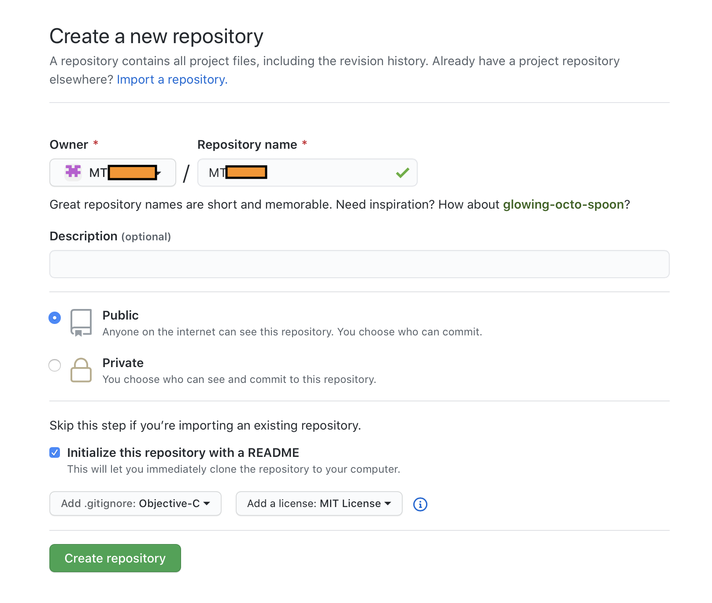

# 建里私有 `pod` 库

#### 1. 打开终端, 进入要建立私有库的路径 执行 `pod lib create <#NAME#>` 
    [16:43:23] ~ ❱❱❱ pod lib create MTMine

**这里会询问几个问题, 答案根据实际情况具体设置**
    
    What platform do you want to use?? [ iOS / macOS ]
    > iOS

    What language do you want to use?? [ Swift / ObjC ]
    > ObjC

    Would you like to include a demo application with your library? [ Yes / No ]
    > Yes

    Which testing frameworks will you use? [ Specta / Kiwi / None ]
    > None

    Would you like to do view based testing? [ Yes / No ]
    > No

    What is your class prefix?
    > MT

    Running pod install on your new library.

    Analyzing dependencies
    Downloading dependencies
    Installing MTMine (0.1.0)
    Generating Pods project
    Integrating client project

    [!] Please close any current Xcode sessions and use `MTMine.xcworkspace` for this project from now on.
    Pod installation complete! There is 1 dependency from the Podfile and 1 total pod installed.

    Ace! you're ready to go!
    We will start you off by opening your project in Xcode
    open 'MTMine/Example/MTMine.xcworkspace'

    To learn more about the template see `https://github.com/CocoaPods/pod-template.git`.
    To learn more about creating a new pod, see `https://guides.cocoapods.org/making/making-a-cocoapod`.
    [16:49:43] [cost 362.904s] 585  pod lib create MTMine

命令执行万会创建一个私有库

```
    .
    ├── Example
    │   ├── MTMine
    │   │   ├── Base.lproj
    │   │   │   ├── LaunchScreen.storyboard
    │   │   │   └── Main.storyboard
    │   │   ├── Images.xcassets
    │   │   ├── MTAppDelegate.h
    │   │   ├── MTAppDelegate.m
    │   │   ├── MTMine-Info.plist
    │   │   ├── MTMine-Prefix.pch
    │   │   ├── MTViewController.h
    │   │   ├── MTViewController.m
    │   │   ├── en.lproj
    │   │   │   └── InfoPlist.strings
    │   │   └── main.m
    │   ├── MTMine.xcodeproj
    │   ├── MTMine.xcworkspace
    │   ├── Podfile
    │   ├── Podfile.lock
    │   ├── Pods
    │   │   ├── Headers
    │   │   ├── Local\ Podspecs
    │   │   │   └── MTMine.podspec.json
    │   │   ├── Manifest.lock
    │   │   ├── Pods.xcodeproj
    │   │   └── Target\ Support\ Files
    │   │       ├── ....
    │   │       .....
    │   │
    │   └── Tests
    │       ├── ...
    │       ....
    │
    ├── LICENSE
    ├── MTMine
    │   ├── Assets
    │   └── Classes
    │       └── ReplaceMe.m
    ├── MTMine.podspec    <-------------------------- 看他看他
    ├── README.md
    └── _Pods.xcodeproj -> Example/Pods/Pods.xcodeproj
```

#### 2. 创建私有库 Git 地址, 这里以 GayHub 为例


#### 3. 修改配置文件 `MTMine.podspec`

```
#
# Be sure to run `pod lib lint MTMine.podspec' to ensure this is a
# valid spec before submitting.
#
# Any lines starting with a # are optional, but their use is encouraged
# To learn more about a Podspec see https://guides.cocoapods.org/syntax/podspec.html
#

Pod::Spec.new do |s|
  s.name             = 'MTMine'                                   # pod 名
  s.version          = '0.1.9'                                    # 版本号
  s.summary          = 'A short description of MTMine.'           # pod 简介
  
  # This description is used to generate tags and improve search results.
  #   * Think: What does it do? Why did you write it? What is the focus?
  #   * Try to keep it short, snappy and to the point.
  #   * Write the description between the DESC delimiters below.
  #   * Finally, don't worry about the indent, CocoaPods strips it!
  
  s.description      = <<-DESC                                    # pod 详细介绍
  TODO: Add long description of the pod here.
  DESC
  
  s.homepage         = 'https://github.com/MTModule/MTMine'       # 主页 要填能打开的网址, 否则不能验证通过
  # s.screenshots     = 'www.example.com/screenshots_1', 'www.example.com/screenshots_2'  # 截图
  s.license          = { :type => 'MIT', :file => 'LICENSE' }     # 开源协议
  s.author           = { '33cun' => 'xiaoxin@evrazlabs.email' }   # 作者信息
  s.source           = { :git => 'https://github.com/MTModule/MTMine.git', :tag => s.version.to_s }  # 私有库的 Git 地址
  
  # s.social_media_url = 'https://twitter.com/<TWITTER_USERNAME>' # 多媒体介绍地址
  
  s.ios.deployment_target = '8.0'                                 # 支持的平台及版本
  
  #   **/*表示Classes目录及其子目录下所有文件，如果有多个目录下则用逗号分开，如果需要在项目中分组显示，这里也要做相应的设置
  s.source_files = 'MTMine/Classes/Target_Mine.{h,m}'             # 源代码文件
  
  
  # 文件分组
  s.subspec 'UI' do |ui|
    ui.public_header_files = 'MTMine/Classes/UI/**/*.h'           # 需要暴露给外界的文件
    ui.source_files = 'MTMine/Classes/UI/**/*'
  end
  
  s.subspec 'Data' do |data|
    data.public_header_files = 'MTMine/Classes/Data/**/*.h'
    data.source_files = 'MTMine/Classes/Data/**/*'
    
  end
  
  s.subspec 'Service' do |service|
    service.public_header_files = 'MTMine/Classes/Service/**/*.h'
    service.source_files = 'MTMine/Classes/Service/**/*'
  end
  
  
  # s.resource_bundles = {
  #   'MTMine' => ['MTMine/Assets/*.png']
  # }
  
  s.public_header_files = 'MTMine/Classes/Target_Mine.h'             # 公开头文件地址
  s.frameworks = 'UIKit'                                             # 所需的framework，多个用逗号隔开
  s.dependency 'AFNetworking'                                        # 依赖关系，该项目所依赖的其他库，如果有多个需要填写多个s.dependency
  s.dependency 'Masonry'
  s.dependency 'CTMediator'
  
end

```
podspec文件的详细说明可以看[Podspec Syntax Reference](http://guides.cocoapods.org/syntax/podspec.html)

#### 4. 打开终端进入 `Example` 文件夹, 执行 `pod install`, 安装依赖
```
[17:55:58] ~/MTMine git(master) 🔥 ❱❱❱ cd Example
[17:56:01] [cost 0.069s] 603  cd Example

[17:56:04] ~/MTMine/Example git(master) 🔥 ❱❱❱ pod install
Analyzing dependencies
Downloading dependencies
Installing AFNetworking (3.2.1)
Installing MTMine 0.1.0
Installing Masonry (1.1.0)
Generating Pods project
Integrating client project
Pod installation complete! There is 1 dependency from the Podfile and 3 total pods installed.
[17:56:40] [cost 1.896s] 604  pod install
```

#### 5. 添加私有库源码
```
.
├── Example
│   ├── MTMine
│   ├── MTMine.xcodeproj
│   ├── MTMine.xcworkspace
│   ├── Podfile
│   ├── Podfile.lock
│   ├── Pods
│   └── Tests
│       ├── Tests-Info.plist
│       ├── Tests-Prefix.pch
│       ├── Tests.m
│       └── en.lproj
├── LICENSE
├── MTMine
│   ├── Assets
│   └── Classes   <----------------- Look Me !
│       ├── XXMTarget.h
│       ├── XXMTarget.m
│       ├── Data
│       ├── Service
│       └── UI
├── MTMine.podspec
├── README.md
└── _Pods.xcodeproj -> Example/Pods/Pods.xcodeproj

41 directories, 136 files
```
- **`~/MTMine/MTMine/Classes` 该文件夹是放私有库源码的地方, 要与 `podspec` 配置一致**
- **只要新增加类、资源文件或依赖的第三方库都需要重新运行 `pod install` 来进行更新。让工程加载新添加的类**

#### 6. 验证私有库正确性
编辑完 podspec 文件后，需要验证一下这个文件是否可用，如果有任何 WARNING 或者 ERROR 都是不可以的，它就不能被添加到 Repo中，不过 Xcode 的 WARNING 是可以存在的，验证需要执行一下命令
> 如果出现
    >```
    >[!] MTHome did not pass validation, due to 15 warnings (but you can use `--allow-warnings` to ignore them).
    >You can use the `--no-clean` option to inspect any issue.
    >```
可以运行 `pod lib lint MTHome.podspec --verbose --allow-warnings --use-libraries` 来忽略警告

#### 7. 提交源码至 GayHub
可以使用 Source Tree, 也能用命令行
- 需要注意的是 
    - 一定要记得添加 `git tag`, `tag` 要与 `MTMine.podspec` 中的 `s.version` 版本要一直

#### 8. 新建私有 Repo 管理库 (已有直接走第3小步)
1. 与 第二步 一样, 在 GayHub 上建立一个仓库, 我取名为 `MTSpecs`
2. 创建完后打开终端, 运行以下命令将 repo 拉至本地
    ```
    pod repo add MTSpecs https://github.com/MTModule/MTSpecs.git
    ```
    执行完成后可以在 `~/.cocoapods/repos/` 路径下看到 `MTSpecs` 文件夹
    ```
    [18:24:43] ~/.cocoapods/repos ❱❱❱ cd ~/.cocoapods/repos/
    PrivatePods/    modulizationdemo/     trunk/    MTSpecs/ <---- This!
    ```
3. 再然后运行以下命令将私有 podspec 发布至 repo
    ```
    [18:29:35] ~/MTMine git(master) 🔥 ❱❱❱ pod repo push MTSpecs MTMine.podspec
    ```
    如果没通过，可以试试以下命令忽略警告。
    ```
    pod repo push MTSpecs MTMine.podspec --allow-warnings
    ```
