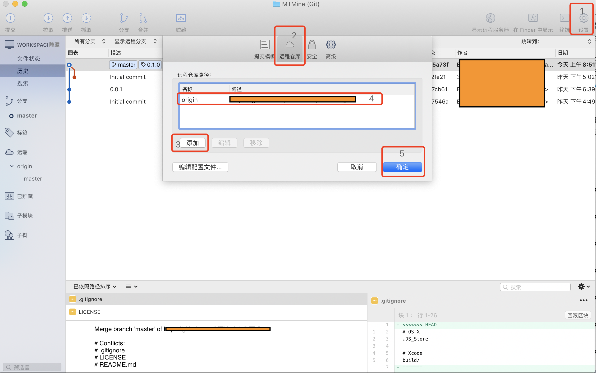
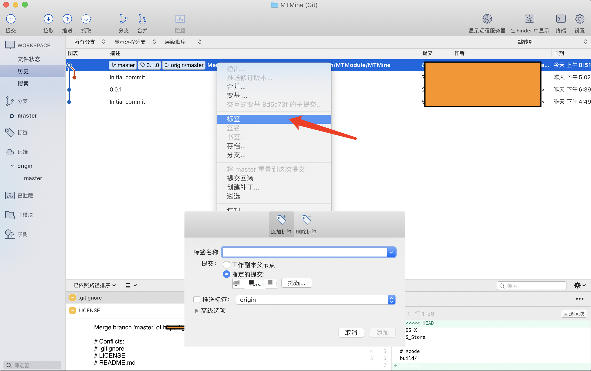

### Source Tree

1. 新建 -> 添加已存在的本地的仓库
2. 点击右上角「设置」
   1. 选择「远程仓库」
   2. 添加
      1. 「远程仓库名」:  `origin`
      2. 「URL/路径」: https://www.gayhub.com/xxxx/xxxx.git
    
3. 拉取代码
4. 提交代码至本地
5. 对刚刚的提交右键设置「标签」
6. 然后push分支至远端
   


### 命令行

```
# 与远程仓库关联
[18:38:36] ~/MTMine git(master) 🔥 ❱❱❱ git remote add origin https://github.com/MTModule/MTMine.git

# 暂存
[18:39:33] ~/MTMine git(master) 🔥 ❱❱❱ git add .

# 提交log
[18:39:38] ~/MTMine git(master) 🔥 ❱❱❱ git commit -a -m "0.0.1"

# 拉代码
[18:41:02] ~/MTMine git(master) ❱❱❱ git pull origin master

# 推代码
[08:52:06] ~/MTMine git(master) ❱❱❱ git push origin master

# 设置 tag
[08:53:11] ~/MTMine git(master) ❱❱❱ git tag 0.1.0

# 提交 tag
[08:53:50] ~/MTMine git(master) ❱❱❱ git push origin 0.1.0

```

